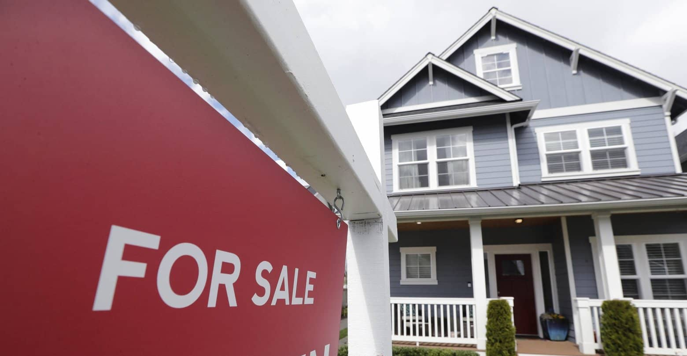

# **House Rocket Insights Project**

This is an insight project where a data base from house sales in the King County (USA) was used to generate insights to help the CEO of a American real-state agency on making decisions about buying and selling properties. The kc_house_data can be found on [Kaggle](https://www.kaggle.com/datasets/harlfoxem/housesalesprediction).

Here, you can find the final dashboard for this project: 
[House Rocket Dashboard APP](https://house-rocket-insights-project.onrender.com/)

# Table of Contents
- [**House Rocket Insights Project**](#house-rocket-insights-project)
- [Table of Contents](#table-of-contents)
- [Business Problem](#business-problem)
- [Business Assumptions](#business-assumptions)
- [Data Dictionary](#data-dictionary)
- [Solution Planning](#solution-planning)
  - [Final Product](#final-product)
  - [Tech Stack](#tech-stack)
  - [Process and Methods:](#process-and-methods)
- [Business Insights](#business-insights)
    - [Report 1:](#report-1)
    - [Report 2:](#report-2)
    - [Hyphotesis Mind-Map:](#hyphotesis-mind-map)
- [Conclusion](#conclusion)
        - [*Financial Results for the Business*](#financial-results-for-the-business)
- [Next Steps](#next-steps)

# Business Problem
House Rocket is a platform for buying and selling properties. Its business model is buying properties and then selling them at a higher price, with the purpose of maximizing profit. The different attributes of the properties influence their quality and drawing power and, therefore, their price.

The CEO would like to maximize the profit of the company, finding good deals. These are the main questions to be answered:

* Which properties should House Rocket buy, and at what price?
* Once the property is aquired, what is the best moment to sell, and by which price?

Currently, the business team is not able to make good buying decisions without analysing the data. The portfolio is extremelly large, and very time consuming for manual analysis.

# Business Assumptions
* Values of 0 in attribute yr_renovated are buildings that were not renovated.
* Recent renovations were considered to be the ones made after, and including, year 2000.
* The attribute price was considered to be the price the property was/will be bought by the House Rocket company.
* The duplicate ID values were removed and only considered the most recent buy.
* The location and condition of the property is key for the decision on wether to buy it or not.
* The season is the decisive variable for the selling of the properties.

# Data Dictionary
This dataset contains house sale prices for King County, which includes Seattle. It includes homes sold between May 2014 and May 2015. There are 21 features for each house:

Variable | Description
--- | ---
`id` |	Unique ID for each home sold
`date` |	Date of the home sale
`price` |	Price of each home sold
`bedrooms` |	Number of bedrooms
`bathrooms` |	Number of bathrooms, where .5 accounts for a room with a toilet but no shower
`sqft_living` |	Square footage of the apartments interior living space
`sqft_lot` |	Square footage of the land space
`floors` |	Number of floors
`waterfront` |	A dummy variable for whether the apartment was overlooking the waterfront or not
`view` |	An index from 0 to 4 of how good the view of the property was
`condition` |	An index from 1 to 5 on the condition of the apartment,
`grade` |	An index from 1 to 13, where 1-3 falls short of building construction and design, 7 has an average level of construction and design, and 11-13 have a high quality level of construction and design.
`sqft_above` |	The square footage of the interior housing space that is above ground level
`sqft_basement` |	The square footage of the interior housing space that is below ground level
`yr_built` |	The year the house was initially built
`yr_renovated` |	The year of the house’s last renovation
`zipcode` |	What zipcode area the house is in
`lat` |	Lattitude
`long` |	Longitude
`sqft_living15` |	The square footage of interior housing living space for the nearest 15 neighbors
`sqft_lot15` |	The square footage of the land lots of the nearest 15 neighbors

# Solution Planning
## Final Product
Planning the look and feel of what will be delivered to the CEO as a final product:
* A link to a Dashboard where he can visualize the answer to his demands as a table containing, in order, the houses he should buy and when is the right moment to sell them, other general metrics and the expected amount of revenue generated from reselling the recommended houses.

## Tech Stack
+ Python 3.*.*
+ Python, Pandas, Numpy
+ Matplotlib, Seaborn, Geopy
+ Jupyter Notebook e VSCode
+ Git e Github
+ Heroku Cloud, Heroku CLI
+ Streamlit

## Process and Methods:
- [STEP 1]: **Importing and Knowing Data**
  - Extract data from Kaggle website: (https://www.kaggle.com/harlfoxem/housesalesprediction)
  - Import it to a pandas dataframe inside a notebook
  - Get to know the Data
  - Print initial summary Stats
- [STEP 2]: **Data Transformation**
  - Clean Data (Missing values, duplicates, transform variables)
  - Feature transformation
- [STEP 3]: **Exploratory Data Analysis**
  - Explore the data to find insights for the business team.
  - Check correlations, distributions, metrics
  - Plot some charts
- [STEP 4]: **Validate Business Hyphotesis**
  - Check if the hyphotesis are true or false
  - Answer why so
  - Create presentation
- [STEP 5]: **Main Business Insights**
  - Compound of findings
- [STEP 6]: **Conclusion**
  - Estimated value of return from the insights generated in this analysis

# Business Insights
### Report 1:
- Table containing 3808 houses that are recommended as good deals for the company.
### Report 2:
- Table containing the recommended houses as well as their expected selling price and date to sell.
### Hyphotesis Mind-Map:
**ID** | **Description** | **Conclusion**
--- | --- | ---
`H01` |	Imóveis que possuem vista para o mar, são 20% mais caros, na média.	| FALSE
`H02` |	Imóveis com data de construção menor que 1955, são 50% mais baratos, na média.	| FALSE
`H03` |	Imóveis sem porão - possuem área total (sqf|t_lot) - são 40% maiores do que os imóveis com porão. |	FALSE
`H04` |	O crescimento do preço dos imóveis YoY (Year over Year) é de 10%. |	FALSE
`H05` |	Imóveis com 3 banheiros tem um crescimento de MoM (Month over Month) médio de 15%.	| FALSE
`H06` |	Imóveis com mais números de quarto são em média 10% mais caros do que outros imóveis com 1 unidade de quartos a menos, em média.	| FALSE
`H07` |	A variação média no preço dos imóveis entre as categorias da variável *condition*, indicam um acréscimo médio de 20% de uma para outra.	| TRUE
`H08` |	Imóveis em más condições mas COM vista para o mar, são em média 40% mais caros do que aqueles em mesmas condições mas SEM vista para o mar. |	FALSE
`H09` |	Para cada nível da variável 'grade', o preço médio dos imóveis aumenta em 18%.	| FALSE
`H10` |	O crescimento WoW (Week over Week) do preço das propriedades é de 0.1%, na média.	| TRUE

# Conclusion
##### *Financial Results for the Business*
After the analysis, among the 21613 properties available for purchase in the King County region, **5809 were suggested for purchase** and detailed in the Dashboard (report 1) for the "CEO".

If the recommended properties are purchased, the initial investment expected is $2.15 billion dollars. Upon resale of all properties, a total of $2.54 billion dollars will be raised and the total expected profit is **$397 million dollars**, totalizing an **18.46% return on the capital initially invested**.

# Next Steps
- Add Docstring to Functions
- Apply more robust techniques to handle with outliers
- Create a ML regression model to predict the price of the houses
- Create a ML model to estimate the optimal reselling price for given house
- Create new hyphotesis and validate them
